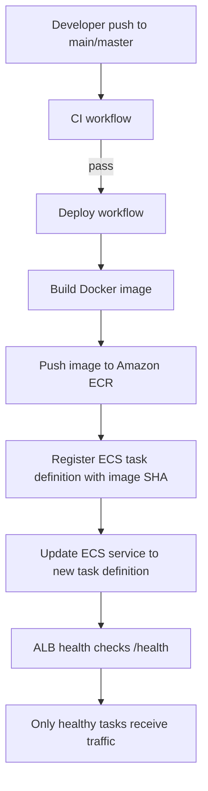

# EV Charging Queue Optimizer

A simulation platform for optimizing electric vehicle charging station assignments based on location, wait times, and energy needs.


---

## ⚠️ Patent Notice

**The core optimization methodology and algorithms in this project are covered by a published patent application (pending grant).** This code is provided for **educational and research purposes only**. Commercial use, redistribution, or implementation of the optimization algorithm — in whole or in part — requires explicit written permission. See the [License](#license) section for full terms.

---

## Overview

This project provides a web-based simulation environment to analyze and optimize electric vehicle charging station assignments. The system reduces wait times and improves charging infrastructure utilization through intelligent routing and queue management.

## Core Optimization Algorithm

*Implemented in `models/optimization.py` — patent pending.*

The algorithm evaluates multiple factors to assign EVs to optimal charging stations:

1. **Accessibility** — Determines if an EV can reach a station with current battery
2. **Route Proximity** — Prioritizes stations close to the EV's planned route
3. **Queue Length** — Considers current waiting times at each station
4. **Charging Time** — Calculates time needed based on current SoC and energy demand
5. **Total Time Cost** — Combines travel, wait, and charge time for overall optimization

## Features

- Real-time simulation of EV movements and charging needs
- Smart charging station assignment based on:
  - Battery level
  - Distance to charging stations
  - Station queue lengths
  - Estimated charging times
  - Route optimization
- Interactive map visualization
- Performance metrics tracking
- Customizable simulation parameters

## Technology Stack

- **Backend:** Python, Flask
- **Frontend:** HTML, CSS, JavaScript, Chart.js
- **Maps API:** Google Maps Platform
- **Data Processing:** NumPy

## Project Structure

```
├── app.py                  # Main Flask application
├── config.py               # Configuration settings
├── models/
│   ├── ev.py               # Electric vehicle model
│   ├── station.py          # Charging station model
│   ├── simulation.py       # Simulation engine
│   ├── optimization.py     # Charging assignment algorithm (patent pending)
│   └── maps_service.py     # Google Maps integration
├── static/
│   ├── css/                # Stylesheets
│   └── js/                 # Client-side scripts
├── templates/
│   └── index.html          # Main UI template
└── utils/
    └── data_generator.py   # Synthetic data generation
```

## Installation

1. Clone the repository:
```bash
   git clone https://github.com/yourusername/ev-charging-queue-optimizer.git
   cd ev-charging-queue-optimizer
```

2. Install dependencies:
```bash
   pip install -r requirements.txt
```

3. Create a local environment file:
```bash
   cp env.example .env
```

4. Update `.env` values as needed:
   - `GOOGLE_MAPS_API_KEY` for route generation
   - `DEBUG` for local debugging (`false` by default)
   - `BOOTSTRAP_SIMULATION` (`true` for full startup, `false` for lightweight smoke tests)
   - `APP_ENV` and `REQUIRE_MAPS_API_KEY` for production safety checks

## Usage

1. Start the server:
```bash
   python app.py
```

2. Open `http://127.0.0.1:5000` in your browser.

### Simulation Controls

- **Start / Stop** — Run or pause the simulation
- **Reset** — Return to initial state
- **Speed** — Adjust playback (1x–10x)
- **Generate New Data** — Create a new scenario with custom parameters:
  - Number of EVs
  - Number of charging stations
  - Number of geographic nodes
  - Number of routes

## AWS Deployment Architecture

### Services in use

- **GitHub Actions CI**: Runs lint, tests, and dependency vulnerability checks on PRs and protected branches.
- **GitHub Actions Deploy**: Deploys only after CI succeeds on `main`/`master` (or manual dispatch).
- **Amazon ECR**: Stores versioned Docker images for the app.
- **Amazon ECS**: Runs the app as a managed service in `ev-queue-3-cluster`.
- **Application Load Balancer (via ECS target group)**: Routes traffic and checks app health through `/health`.
- **IAM credentials in GitHub Secrets**: Authorize CI to push images and trigger ECS deployment.

### Deployment and runtime flow



### Why this design

- **ECR + ECS** provides a straightforward container deployment path with low operational overhead.
- **GitHub Actions** keeps deployment automated and reproducible from source control events.
- **`/health` endpoint** supports safe task replacement and load balancer health-based routing.
- **Gunicorn in Docker** gives a production-ready Flask serving model for ECS tasks.

### Operational notes

- Runtime configuration is environment-first (`config.py` reads environment variables and `.env` for local development).
- In production, set `APP_ENV=production` and keep `REQUIRE_MAPS_API_KEY=true` so startup fails fast if map credentials are missing.
- The container intentionally runs one Gunicorn worker and one ECS task because live simulation state is stored in process memory. Move state to Redis or a database before scaling workers or ECS task count.
- Deployment now registers a new ECS task definition revision per image tag and updates the service to that exact revision.

## License

This project is licensed under a custom license — see the [LICENSE](LICENSE) file for details.

The core optimization methodology is subject to a **pending patent**. Code is provided for educational and research purposes only. Commercial use or implementation of the optimization algorithm requires explicit written permission.

## Acknowledgments

- Google Maps Platform — geospatial services
- Chart.js — visualization components
- Flask — web framework

## Contact

For inquiries regarding licensing or commercial use: cvbalaji19672004@gmail.com
